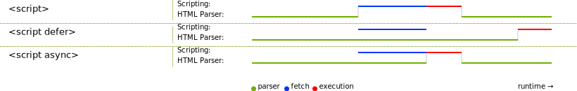

> 介绍引入 JavaScript 的方式。

## 内联（配合事件）

可以直接把 JS 代码写在标签里，当触发事件时，则执行对应的 JS 代码。这种方式很少用，一是因为这破坏了 HTML 专职表达内容的习惯，提高了耦合度；二是因为这样不利于 JS 代码的复用。例如：

<p class="codepen" data-height="300" data-default-tab="html,result" data-slug-hash="bGooaQm" data-editable="true" data-user="luckyzhz" style="height: 300px; box-sizing: border-box; display: flex; align-items: center; justify-content: center; border: 2px solid; margin: 1em 0; padding: 1em;">
  <span>See the Pen <a href="https://codepen.io/luckyzhz/pen/bGooaQm">
  Untitled</a> by luckyzhz (<a href="https://codepen.io/luckyzhz">@luckyzhz</a>)
  on <a href="https://codepen.io">CodePen</a>.</span>
</p>
<script async src="https://cpwebassets.codepen.io/assets/embed/ei.js"></script>

## 嵌入（`<script>` 标签）

第二种引入方式是利用 `<script>` 标签把 JS 嵌入到当前网页 HTML。例如：

```html
<script>
  这里放置 JS 代码...
</script>
```

## 外部 JavaScript

第三种引入方式是引入外部 JavaScript 文件（以 `.js` 为扩展名），还是需要使用 `<script>` 标签。例如：

```html
<script src="script.js"></script>
```

也就是说，我们需要使用 `<script>` 标签的 `src` 属性来指明外部 JavaScript 文件的位置。

## JavaScript 的加载策略

不论是嵌入还是外部引用，都涉及 JavaScript 的引入位置的问题。也就是 JavaScript 应该放在哪里？另外如果有多个脚本，会不会存在依赖问题。例如：

```html
<script src="js/jquery.js"></script>
<script src="js/script2.js"></script>
<script src="js/script3.js"></script>
```

上面三个脚本，有可能是相互独立的；也有可能，`script2.js` 或 `script3.js` 需要依赖于 `jquery.js` 才能运行。

HTML 文件是由上到下依次加载渲染的，当用 JavaScript 来操作页面上的元素（或者说操作文档对象模型 DOM），若 JavaScript 加载于欲操作的 HTML 元素之前，则代码将出错。

1. 旧方法是，把 JS 放在 `<body>` 的底端（`</body>` 标签之前，与之相邻），这样脚本就可以在 HTML 解析完毕后加载了。
   * 可能带来的问题：只有在所有 HTML DOM 加载完成后才开始 JS 的加载/解析。对于有大量 JS 代码的大型网站，可能会带来显著的性能损耗。
2. 如果是外部 JavaScript，可以利用 `<script>` 标签的 `async` 和 `defer` 属性（对于嵌入的 JS，这两个属性不起作用）。
   * `async` 表示异步（asynchronous）。也就是，加载 JS 的时候，不会造成阻塞，JS 后面的内容可以同时加载。当 JS 加载完毕后就会执行。这样脚本的运行次序就无法控制，只是脚本不会阻止剩余页面的显示。当页面的脚本之间彼此独立，且不依赖于本页面的其他任何脚本时，`async` 是最理想的选择。例如下面三个 JS 的调用顺序是不确定的：
```html
<script async src="js/jquery.js"></script>
<script async src="js/script2.js"></script>
<script async src="js/script3.js"></script>
```
   * `defer` 表示延迟。例如：
```html
<script defer src="js/jquery.js"></script>
<script defer src="js/script2.js"></script>
<script defer src="js/script3.js"></script>
```
   使用 `defer` 属性的脚本的特点：
     * 按照出现在页面的顺序加载。
     * 在页面内容全部加载后才会运行。如果脚本依赖于 DOM 就位（例如，脚本修改页面上的一个或多个元素），这将非常有用。

下图是不同脚本加载方法的区别的可视化表示：



**总结**：

1. `async` 和 `defer` 属性都指示浏览器在单独的线程中下载脚本，因此在**获取**过程中不会阻塞页面加载。
2. 具有 `async` 属性的脚本将在下载完成后立即执行。**执行**时会阻塞页面加载，并且多个脚本间不保证任何特定的执行顺序。
3. 带有 `defer` 属性的脚本将按照他们所在的**顺序**加载，并且只有**在所有内容都完成加载后**才会**执行**。
4. 如果您的脚本应该**立即运行**并且他们**没有任何依赖项**，那么请使用 `async`。
5. 如果您的脚本需要等待解析并**依赖于其他脚本**或 **DOM 就位**，请使用 `defer` 属性加载他们，并按照您希望浏览器执行他们的**顺序**放置相应的 `<script>` 元素。


> 更新时间：{docsify-updated}